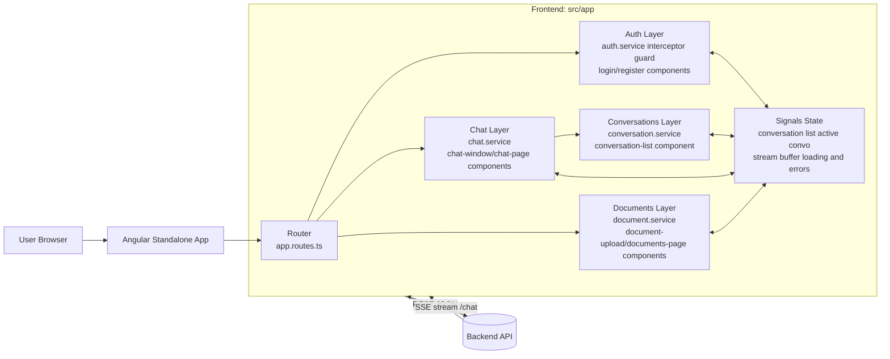

# Cents Frontend

Cents Frontend is an Angular standalone application for a multi-user chatbot.
It handles authentication, conversation management, real-time streamed chat responses, and document uploads.

## What This App Does

- Authenticates users with JWT-based requests.
- Lets users create, rename, delete, and switch conversations.
- Sends chat messages and renders server-streamed responses using SSE over fetch.
- Uploads and lists documents tied to the user/workspace context.
- Protects chat and document routes behind authentication.

## Architecture At A Glance



## Main Runtime Flows

### 1) Authentication Flow

1. User logs in or registers.
2. Auth service stores token in memory and keeps current user in a signal.
3. Interceptor attaches Authorization: Bearer <token> to outgoing HTTP calls.
4. On 401 responses, interceptor triggers unauthorized handling and redirects to /login.
5. Guard runs a silent session check on guarded routes before deciding whether to redirect.

### 2) Conversation Flow

1. Conversation list loads from backend.
2. Conversations are sorted by updated_at (most recent first).
3. Active conversation id is stored in signal state.
4. Sidebar actions create, rename, and delete via REST.

### 3) Chat Streaming Flow

1. User sends message in active conversation.
2. Chat service posts to /chat and opens a fetch-based SSE stream.
3. Incoming token/message chunks append to streaming buffer signal.
4. On stream completion, buffered content is committed as assistant message.
5. Stream closes on completion, manual close, or component destroy.
6. Stream errors are surfaced in UI and not swallowed.

### 4) Document Flow

1. Documents page lists existing uploads.
2. Upload component posts multipart/form-data.
3. Upload progress updates live from HttpClient progress events.
4. Success prepends uploaded document to list; errors render in UI.

## Tech Stack

- Angular 22 (standalone components, no NgModules)
- Angular Router
- Angular HttpClient + functional interceptor
- Angular signals for local state
- Fetch-based SSE parser for chat streaming
- TypeScript

## Project Layout

- src/app/auth
- src/app/chat
- src/app/conversations
- src/app/documents
- src/app/core
- src/app/app.routes.ts
- src/app/app.config.ts
- src/environments/environment.ts
- src/environments/environment.development.ts

## Key Files By Responsibility

- App routing and providers: src/app/app.routes.ts, src/app/app.config.ts
- API base URL wiring: src/app/core/api-config.ts, src/environments/*
- Auth and session lifecycle: src/app/auth/auth.service.ts
- JWT attachment and 401 behavior: src/app/auth/auth.interceptor.ts
- Guarded route access: src/app/auth/auth.guard.ts
- Conversation CRUD and active selection: src/app/conversations/conversation.service.ts
- Chat streaming and lifecycle: src/app/chat/chat.service.ts
- Document list and upload progress: src/app/documents/document.service.ts

## Routes

- /login
- /register
- /chat (guarded)
- /documents (guarded)

## Local Setup

1. Install dependencies.

```bash
npm install
```

2. Set backend URL in environment files.

- Development file: src/environments/environment.development.ts
- Production template file: src/environments/environment.ts

3. Run the app.

```bash
npm run start
```

4. Open http://localhost:4200

## Environment Template

Use the following shape for both environment files:

```ts
export const environment = {
  production: false,
  apiBaseUrl: 'http://localhost:8000',
};
```

Production example:

```ts
export const environment = {
  production: true,
  apiBaseUrl: 'https://api.example.com',
};
```

## Commands

- Start dev server: npm run start
- Build: npm run build
- Unit tests: npm run test

## Developer Handoff Notes

- Backend URL is never hardcoded in services; always sourced from environment config.
- Chat streaming currently expects SSE chunks with data: lines containing either token/message payloads, done markers, or [DONE].
- Auth token is kept in memory by design; silent session check restores session context on guarded route access.
- All major async operations expose loading and error states in the UI.

## First Day Checklist For A New Developer

1. Run npm install and npm run start.
2. Verify environment.development.ts points to a reachable backend.
3. Test auth, conversation CRUD, chat stream, and document upload paths.
4. Confirm 401 behavior redirects to /login.
5. Review chat.service.ts and backend /chat event schema alignment.
