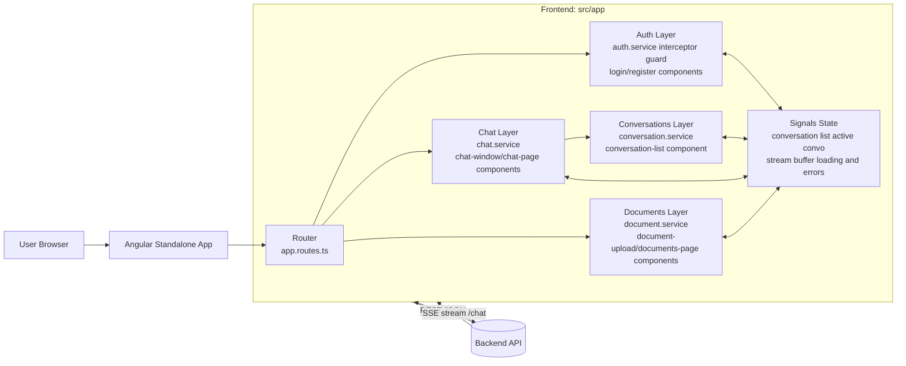

# Cents Frontend

Cents Frontend is an Angular standalone application for a multi-user chatbot.
It handles authentication, conversation management, real-time streamed chat responses, and document uploads.

## What This App Does

- Authenticates users with JWT-based requests.
- Lets users create, rename, delete, and switch conversations.
- Sends chat messages and renders server-streamed responses using SSE over fetch.
- Uploads and lists documents tied to the user/workspace context.
- Manages tool definitions (create, edit, enable/disable, delete) used by backend retrieval.
- Lists agent templates with validity and enabled status, supports version history review, and lets admins enable/disable or delete templates.
- Provides natural-language, visual-graph, and read-only JSON views for creating, validating, and versioning sub-agents.
- Lets authors configure Action nodes as HTTP calls or registered tool calls directly in the visual graph editor.
- Protects chat and document routes behind authentication.

## Architecture At A Glance



## Main Runtime Flows

### 1) Authentication Flow

1. User logs in or registers.
2. Auth service stores token in memory and keeps current user in a signal.
3. Interceptor attaches Authorization: Bearer <token> to outgoing HTTP calls.
4. On 401 responses, interceptor triggers unauthorized handling and redirects to /login.
5. Guard runs a silent session check on guarded routes before deciding whether to redirect.

### 2) Conversation Flow

1. Conversation list loads from backend.
2. Conversations are sorted by updated_at (most recent first).
3. Active conversation id is stored in signal state.
4. Sidebar actions create, rename, and delete via REST.

### 3) Chat Streaming Flow

1. User sends message in active conversation.
2. Chat service posts to /chat and opens a fetch-based SSE stream.
3. Incoming token/message chunks append to streaming buffer signal.
4. On stream completion, buffered content is committed as assistant message.
5. Stream closes on completion, manual close, or component destroy.
6. Stream errors are surfaced in UI and not swallowed.

### 4) Document Flow

1. Documents page lists existing uploads.
2. Upload component posts multipart/form-data.
3. Upload progress updates live from HttpClient progress events.
4. Success prepends uploaded document to list; errors render in UI.

### 5) Sub-Agent Authoring Flow

The editor keeps one canonical `AgentTemplate` draft across all three authoring views:

1. **Natural Language** accepts a complete, multiline workflow source document. `Build graph` sends the source to `POST /agents/authoring/generate` without the starter template, so recompilation reflects the document rather than accumulating unrelated starter nodes.
2. The backend asks the LLM for a complete template, validates it against the schema and graph rules, and returns structured errors when it cannot be applied.
3. A valid result replaces the canonical draft. Angular computed state immediately projects that template into the Visual Graph and Advanced JSON views.
4. **Visual Graph** edits the same draft. Drag a node's **Connect** outlet and release anywhere over another node; Foblex resolves the destination node's target connector and emits `FCreateConnectionEvent`.
5. Source connectors retain transition meaning: `next`, `on_failure`, and named condition branches. The application owns edge replacement rules and persists only semantic graph data, not viewport layout.
6. Action (`service_call`) nodes can be configured in-editor as either `HTTP service` mode (`method`, `url`, headers/body templates) or `Registered tool` mode (`tool_name`/`tool_id`, `tool_input_template`, timeout).
7. A single click selects a node for movement or deletion. Double-click, Enter, or Space opens its editor. Connections render as labeled lines without directional markers.
8. **Advanced JSON Preview** exposes the canonical payload that validation and save operations use.

The graph uses the installed `@foblex/flow` unified connector API. The visible Connect control is an `outlet`, connection creation uses the native drag flow and preview, and `fConnectOnNode` enables node-body drop targets. This follows the library's current [connector](https://flow.foblex.com/docs/f-connector-directive) and [connection preview](https://flow.foblex.com/docs/f-connection-for-create-component) contracts instead of implementing custom pointer geometry.

Natural-language source, visual graph, and JSON preview are synchronized from one canonical `AgentTemplate` draft while editing. Saved versions persist the validated `AgentTemplate`, not the original prose text.

## Tech Stack

- Angular 22 (standalone components, no NgModules)
- Angular Router
- Angular HttpClient + functional interceptor
- Angular signals for local state
- Fetch-based SSE parser for chat streaming
- TypeScript

## Project Layout

- src/app/auth
- src/app/chat
- src/app/conversations
- src/app/documents
- src/app/agents
- src/app/core
- src/app/app.routes.ts
- src/app/app.config.ts
- src/environments/environment.ts
- src/environments/environment.development.ts

## Key Files By Responsibility

- App routing and providers: src/app/app.routes.ts, src/app/app.config.ts
- API base URL wiring: src/app/core/api-config.ts, src/environments/*
- Auth and session lifecycle: src/app/auth/auth.service.ts
- JWT attachment and 401 behavior: src/app/auth/auth.interceptor.ts
- Guarded route access: src/app/auth/auth.guard.ts
- Conversation CRUD and active selection: src/app/conversations/conversation.service.ts
- Chat streaming and lifecycle: src/app/chat/chat.service.ts
- Document list and upload progress: src/app/documents/document.service.ts
- Agent template list and management: src/app/agents/agent.service.ts, src/app/agents/agents-page/*
- Agent template authoring, graph interaction, and validation: src/app/agents/agent-template-editor/*

## Routes

- /login
- /register
- /chat (guarded)
- /documents (guarded)
- /tools (guarded)
- /agents (guarded)
- /agents/new (guarded, template editor create mode)
- /agents/:name/edit (guarded, template editor versioned edit mode)

## Runtime orchestration behavior (user-visible)

When a user sends a chat message, the backend may answer through one of two paths:

1. Select and execute an enabled sub-agent when the query aligns with an agent description.
2. Use the default top-level flow (tools/docs/direct retrieval + generation) when no sub-agent is a reliable match.

The selection process is hybrid: direct name match first, semantic description ranking next, lexical fallback last. This means authoring clear sub-agent descriptions directly improves routing accuracy users see in chat.

## Local Setup

The commands below are cross-platform and work in:

- Windows: Command Prompt (cmd)
- macOS/Linux: Terminal (bash/zsh)

1. Run automatic setup.

```bash
npm run setup
```

This command will:

- Install dependencies with npm ci (or npm install if no lockfile exists)
- Ensure environment files exist and include apiBaseUrl
- Print the next steps to start the app

2. (Optional) Update backend URL for local development.

- File: src/environments/environment.development.ts
- Default: http://localhost:8000

3. Start the app.

```bash
npm run start
```

4. Open http://localhost:4200

## Alternative Start Commands

- Standard development start: npm run start
- Expose dev server on LAN: npm run start:host
- Serve production configuration locally: npm run start:prod

## Manual Setup (If You Prefer)

1. Install dependencies.

```bash
npm install
```

2. Set backend URL in environment files.

- Development file: src/environments/environment.development.ts
- Production template file: src/environments/environment.ts

3. Run the app.

```bash
npm run start
```

4. Open http://localhost:4200

## Environment Template

Use the following shape for both environment files:

```ts
export const environment = {
  production: false,
  apiBaseUrl: 'http://localhost:8000',
};
```

Production example:

```ts
export const environment = {
  production: true,
  apiBaseUrl: 'https://api.example.com',
};
```

## Commands

- Automated setup: npm run setup
- Start dev server: npm run start
- Start dev server on LAN: npm run start:host
- Start with production configuration: npm run start:prod
- Build: npm run build
- Unit tests: npm run test

## Developer Handoff Notes

- Backend URL is never hardcoded in services; always sourced from environment config.
- Chat streaming currently expects SSE chunks with data: lines containing either token/message payloads, done markers, or [DONE].
- Auth token is kept in memory by design; silent session check restores session context on guarded route access.
- All major async operations expose loading and error states in the UI.

## First Day Checklist For A New Developer

1. Run npm run setup, then npm run start.
2. Verify environment.development.ts points to a reachable backend.
3. Test auth, conversation CRUD, chat stream, and document upload paths.
4. Confirm 401 behavior redirects to /login.
5. Review chat.service.ts and backend /chat event schema alignment.
